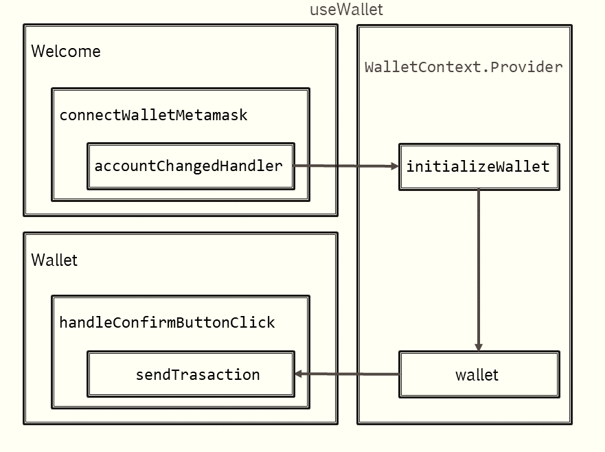

## Lab 1

As you can imagine, as developers, we don't usually interact with the core technologies of the various existing types of blockchain, since they need deep understanding of cryptography, algebra, distributed system and much more disciplines (so no, we won't create blockchain from scratch here).

What we do instead, is understanding the principles behind it and, most of the time, interact with the blockchain as a whole through some programs called **Smart Contracts**. These are technologies that were released in the recent versions of Bitcoin and Ethereum blockchains and represent pieces of code that, once they are deployed in a blockchain, they are triggered automatically by the transactions made within the network.

These being said, in order to build these components, we firstly have to setup our environments so that we have the necessary tools to create a transaction (accounts and money; shortly, a wallet), to have access to a public network where we can see our transactions in action as well as deploy our smart contracts and also a local environment where we can test our code without bothering of transaction taxes (called **gas**) and others.

Thus, in this first lab we will implement the basic functionalities of an Ethereum wallet.


### MetaMask Accounts - The Wallet
Open the MetaMask browser extension and create at least two Ethereum accounts for the Sepolia testnet. We should be able to demonstrate transfers between accounts. 

In an Ethereum network, an account is linked to a pair of public/private keys and has a balance of ETH. Ethereum wallet applications provide access to funds: inspect balances, transfer funds, manage other tokens linked to a private key.

Private keys should be kept on users’ device and never stored on server-side. In Metamask keys are stored in browser’s files and may be recovered with a [mnemonic phrase](
https://support.metamask.io/privacy-and-security/what-is-a-secret-recovery-phrase-and-how-to-keep-your-crypto-wallet-secure/).

A **mnemonic phrase**, also known as a seed phrase or recovery phrase, is a series of words, typically 12 or 24, used to back up and restore a cryptocurrency wallet. The phrase is a human-readable representation of the wallet's private keys, allowing users to regain access to their funds if their device is lost, stolen, or damaged.

**Hot wallets**: online (mobile wallets, web wallets), fast and easy to set up but vulnerable to attacks.

**Cold wallets**: offline (hardware wallets), less convenient for frequent transactions but highly secure for long-term holdings.

Smaller denominations of Ether easier to use in transactions since transactions usually involve less than 1 eth:
- 1 Ether = 10<sup>3</sup> Finney
- 1 Ether = 10<sup>9</sup> Gwei
- 1 Ether = 10<sup>18</sup> Wei

[Ethereum unit converter](https://info.etherscan.com/ethereum-unit-converter/)


### Sepolia - The Public Network

Sepolia is a testing network (**testnet**) where developers deploy their contracts to test them in real environments, before deploying them in **mainnet** where the real money flow. That's why no ETH here has any value.

For the next steps you have to get some Sepolia ETH for at least one of your Metamasks accounts using [this faucet](https://sepolia-faucet.pk910.de/). In short, a faucet is a tool that helps you mine fake ETH for your Metamask account in order to be able to create some transactions on the Sepolia testnet. These fake coins are mined using your PC's computing power, so no real money is involved, just electricity.


### Deployment

We mentioned deployment a few times before, but now let's understand it properly. On a traditional server, "deploying" means uploading files to a cloud like AWS. On a blockchain, it’s a bit different. Deployment is the act of sending a special transaction to the network that contains your contract's compiled bytecode.

Basically, when you deploy a contract on Sepolia for example, the network sees a transaction without a "To" address. Thus, it knows it's a "Create Contract" operation and in this way Ethereum Virtual Machine (EVM) creates an account for it. Further, once the transaction is mined (included in a block from the blockchain) it is associated a specific hash (0x123...) which is returned if the deployment succeeded.

Hardhat local network vs Sepolia Ethernet vs Mainnet Ethernet

### Hardhat - The Local Environment

Hardhat is an environment for smart contracts development. It helps the developers run and test their smart contracts before deploying them to real blockchains and start interacting with real coins. It does that by running a local blockchain, which is started every time a developer runs it. Moreover, in order for this blockchain to exist, Hardhat provides also a local network i.e. a server that runs on localhost and is initiated with 20 "fake" accounts with 10,000 ETH each so you can test instantly without waiting for external network confirmations.

In an empty folder create a Hardhat project.
First, install Hardhat using npm. Use **init** to create the project structure.

```bash
npm install --save hardhat
```

```bash
npx hardhat --init
```

Next, you have to [link Metamask to the Hardhat development network](https://docs.metamask.io/wallet/how-to/run-devnet/). In this way you can test if the Metamask is correctly setup by testing it against the local network.


```bash
npx hardhat node
```

### The Interface

Next, clone the **Laborator1** and set it up. It provides a minimalist frontend that helps us interacting with the local blockchain.

```bash
npm install
```

```bash
npm start
```

**Components**

The application has two main components:
- **Welcome page**: This page presents generic information and a button that will create a wallet component based on the connection with MetaMask.
- **Wallet page**: This page shows the balance of the account connected with MetaMask. It also opens a pop-up form that allows ETH transfers. 

In **App.js**, you will find a **RouterProvider** for navigation between the two components and a Context providing a Wallet component, which is the **WalletContext** encapsulating a **WalletProvider**.

The implementation for the **WalletContext** is found in utils/Context.js

**`Wallet` Context provides:**
- **initializeWallet**: a callback function to instantiate the wallet. This function is called in the Welcome page after a successful connection to the MetaMask Wallet.
- **wallet**: the account connected with MetaMask, i.e., the signer of the transactions. 




**Ether Library**

Wallet functionalities are added in utils/EthersUtils.js.

[Ether library docs](https://docs.ethers.org/v5/).

Ethers is a library for interacting with the Ethereum Blockchain and its ecosystem. 

The classes most developers will use are **Provider** and **Wallet**. 

The following code instantiates a BrowserProvider i.e. MetaMask. We get the active account (the signer Wallet) by calling `eth_requestAccounts` on the provider.

```js
const ethers = require('ethers');

const provider = new ethers.BrowserProvider(window.ethereum);


if (window.ethereum) {
    provider.send("eth_requestAccounts", []).then(async () => {
      provider.getSigner().then(async (account) => {
        //use account ;
      });
    }
    ).catch(async () => { console.log("err"); });
  } else {
    console.log("err");
}

```

A Wallet can load a private key directly or from any common wallet format. We use the wallet to send transactions. Each transaction has a recipient and a value.

```js
const transactionResponse = await wallet.sendTransaction({
    to,
    value: ethers.parseUnits(amount.toString(), 'wei')
});
```

---

### Assignments

- Add a component listing all transactions of the account as a list of transaction hashes.
- Get the transaction receipts from transaction hashes and add functionalities to get: the amount of gas spent for a transaction, the block number, the block timestamp of the block in which the transaction is included; hint: Use the transaction hash returned by the Etherscan API.

**Resources**:

- https://etherscan.io/
- https://etherscan.io/apis
- https://docs.ethers.org/v5/api/providers/api-providers/#EtherscanProvider

