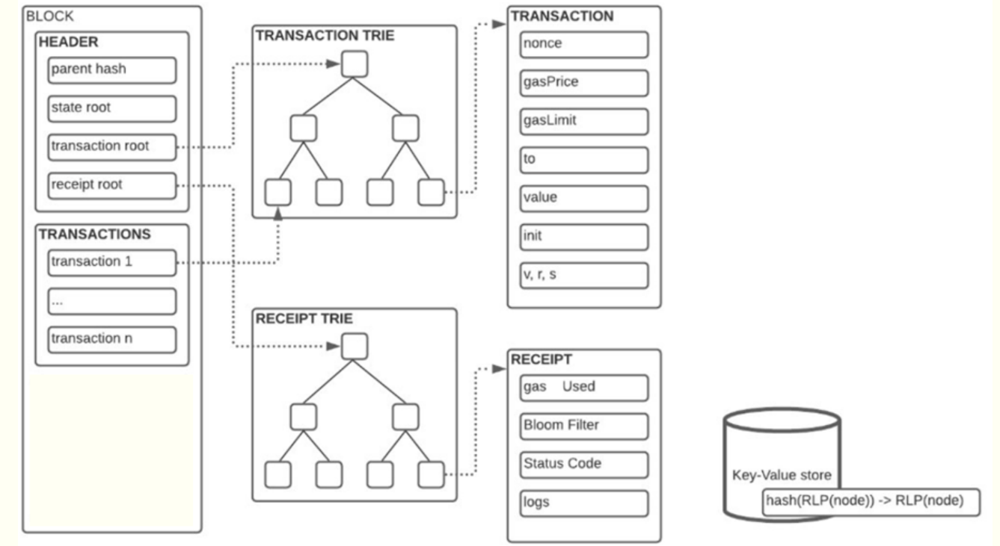

## Sources

- https://ethereum.org/developers/docs/scaling/
- https://gavwood.com/dappsweb3.html
- Satoshi Nakamoto. “Bitcoin: A peer-to-peer electronic cash system”. In: Decentralized business review (2008), p. 21260.
- https://ethereum.org/developers/docs/consensus-mechanisms/pos/

## Course 1

#### Blockchain overview

- Cryptography, P2P networks and communication, Consensus protocols (longest chain rule)
- Block generation: Proof of Work, Proof of Stake
- Block propagation: **gossip** all blocks (received or locally generated) should be advertised to peers and broadcast
- A blockchain is a public database that is updated and shared across many computers in a network.

#### Blockchain characteristics

- Public ledger: UTXO model, SMR model
- Auditable: Transactions are timestamp and signed.
- Traceability: Each block is linked to a parent (previous) block
- Immutable: A public blockchain is a series of immutable record of data. Once a new transactions is added to the blockchain it cannot be reverted
- CAP theorem
- Decentralized, peer-to-peer: Information is stored in a cluster of computers, there is no central authority. Everyone is accountable. Everyone keeps a copy of the database.
- Transparent: Everyone has access to all information.
- Secure: use asymmetric cryptography, data blocks are linked via hashes (blockchain) and protected via cryptographic functions
- Anonymity (pseudonimity): each participant may store several pairs of public-private keys to sign transactions or to prove ownership of his assets (UTXOs, ETHs, NFTs etc.) Identity is not revealed
- Taxonomy: Permissionless vs Permissioned, Public vs Private vs Consortium

#### Blockchain 2.0

- Smart Contracts & Examples of Mainnet smart contracts
- Under the hood, smart contracts are also accounts (with public and private keys) that also have a balance
- Ehtereum: Distributed ledger to a distributed state machine with EVM, which is Turing Complete
- Scaling solutions: Layer 1: Sharding; Layer 2: Rollup, Sidechains
- **Sidechains** are separate blockchains running their own consensus protocols to speed up the transfer of assets. **Rollups** execute hundreds of transactions outside the blockchain, compressed the transactions together, and sends them to the main network.
- Layer 1 scaling solution improve the chain itself, for example by changing the protocol form PoW to PoS or by implementing sharding, i.e. dividing information between nodes.
- Ethereum standards: ERC-20, ERC-721
- Decentralized Autonomous Organizations (DAO)
- 

#### Issue and attacks

- Mining pools and centralization
- denial-of-service (DDoS), sybil attacks

**51% attacks**
- Present the scenario and lack of incentive
- Decentralization

**Double spending**
- check the forks section

## Course 2: UTXO

#### Bitcoin UTXO Model

- Public key - private key
- A wallet is a collection of public/private key-pairs
- You can send coins by public key, but can only receive coins by private key
- The balance is obtained by calculating UTXOs from the all transactions; they are stored in a DB called **Chainstate**
- **Coinbase transactions**
- A transaction input is a reference to a previous transaction output (check the lecture 2 image)
- `scriptSig` and `scriptPubKey` are the Bitcoin scripts used as follows (need better research):
  - When Alice wants to send Bob some coins knowing his public key and the system must assure only the Bob's private key can decrypt that
  - When Bob wants to use the transaction output of previous transactions using its public key to verify he is the right owner of those coins
- 

## Course 3: Ethereum

- Ethereum blockchain is based on the **Account Model** transactions
- This model has integrated a transition function which returns a new state if given the current state of the account and the transaction. Basically, it's a chain of states
- **State root** store the address of the account
- EIP-1559
- 

#### Transaction

- 3 types of transactions: transfer, contract creation, contract call
- [lab 3 docs](./Laborator3/README.md)

## Forks

- Since these blockchain are adopted more and more, the techinical details of the system changes to integrate more demanded features and provide greater scalability and security. But this is a very cumbersome thing to do with a decentralized system since we can introduce breaking changes or inconsistent operations. For that, forks were created.
- Soft forks & hard forks
- Compatibility
- For instance, after a hard fork that increases the limit of the block size, blocks generated before the fork would pass the new requirement since they fit in a lower size limit. But new blocks, with size grater than the previous limit, would not be accepted by nodes running the older version of the protocol
- **A hard fork** occurs when security risks must be mitigated, new functionalities are added, or when some transactions must be reverted to correct the effects of an attack.
- ASIC mining vs GPU mining
- Ethereum Improvement Proposals (EIPs) describe standards for the Ethereum platform, including core protocol specifications, client APIs, and contract standards. While Ethereum predominantly employs hard forks for protocol upgrades due to architectural considerations and the desire for network-wide coordination, certain EIPs function as soft forks by tightening rather than loosening consensus rules. However, Ethereum’s social contract and upgrade philosophy generally favor coordinated hard forks to ensure all nodes remain synchronized and avoid permanent chain splits, unlike Bitcoin’s more conservative approach that prioritizes backward compatibility through soft fork mechanisms.

## Consensus Protocols: How new blocks are added into a blockchain?

- Since we talk about a distributed system, we are concerned about the **exact** synchronization of system state between the nodes, more concretely, which should be the next block to be added in the blockchain (supposing that every node has the same state until then); for this, a **consensus mechanism** is used, which makes sure everybody in the system agrees upon this next block and will accept it when the information reaches to them (everything happens async since it's a distributes system)
- By consensus, we mean that a general agreement has been reached. Consider a group of people going to the cinema. If there is no disagreement on a proposed choice of film, then a consensus is achieved. If there is disagreement, the group must have the means to decide which film to see. In extreme cases, the group will eventually split.
- What follows are different components of consensus mechanism used by different blockchain to make sure the consensus is **Sybil Resistant**, that is, no participant in the system can benefit anything from owning more nodes (and increasing their chances to win the proposal for the next block and get rewarded)

#### Bitcoin: Proof of Work

**History**
- Hashcash & Reusable Proof of Work RPOW

**How a block is decided**
- Nodes validate transactions, store in local **Transaction pools** and broadcast to other nodes in the system with P2P messages
- Each nodes take some set of transactions from the pool and defines a block to be appended in the blockchain (that block stores in the header the previous block hash, a link to root of the transactions tree and a timestamp)
- Some nodes work to try finding the **nonce** as in hashcash method, but now the constraint is the block header hash to be less then a value stored also in the block header, which is proportional to the difficulty of finding the number
- After solving the hashcash puzzle, the node firstly appends the block to its local blockchain, then broadcasts it to other nodes in the system
- All nodes at some point have to accept the block in their local versions

**Adaptability**
- The field from the **block header** that regulates the difficulty is called **difficulty_target** and is calibrated depending on how fast the last $2016$ blocks were computed: if it was faster then 2 weeks, then the difficulty raises, otherwise it lowers

**Consensus conflicts**
- But what happens when there are 2 proposals of the next block that take place at the same time? Which one will the network choose, since some nodes can have one, and others the other?
- This issue is handled locally, on each node, by accepting both proposals, but creating 2 branches, one for a proposal
- Thus, when the next block is mined and broadcasted in the network, it will be appended to one of these 2 branches, more exactly to the one with the longest chain (here, theoretically, length refers to the cumulated difficulty of the branch's chain; but since everyone has most of the time the same mining difficulty, then usually it means the number of blocks in the chain)
- Now, the blocks in shorter chain are going back in the transaction pool and the rewards to their miners are lost. Because of this instability, the miners receive the rewards only about $100$ blocks - a principle adopted by the network called **100-block maturation**
- This is not an issue per se, even though both computational power and time are lost, since this mechanism prevents double-spending (when someone tries to mine simultaneously 2 blocks at the same time with the same input, normally both of them will be accepted by the others since they are correct; but in this system at most one of them will be accepted by the other nodes since there will be conflicts); one can view this waste as the **fare** in order for the system to work properly; besides this, given the fact that a transaction is accepted once in approximately 10 minutes, it lowers pretty much the time for conflicts
- The halving process is one of the primary means to keep Bitcoin cryptocurrency deflationary as halving reduces the available amount of new supply, as demand increases

#### Proof of Stake (Ethereum)

- In this approach, there is a set of validators that propose the next block, together with a monetary fund of ETH (a stake) which represents actually the weight of its stake; then, the system chooses randomly one validator depending on their weights; finally, the winner gets rewarded and the losers lose their stake
- **Proof of Stake** is based on the principle that if you put more ETH 
- In regard to the Ethereum blockchain, the process is formalized, and reaching consensus means that at least 66% of the nodes on the network agree on the global state of the network.
- Before going further into explaining how PoS based consensus algorithm works in Ethereum, it's necessary to enumerate the 3 roles nodes can take within the system: execution, consensus and validator. In most of the cases, nodes usually take multiple roles at once for better scalability and fault-tolerance. Thus, in order to handle that, each node must have specific programs running within them to be able to take the role. These programs are called **clients**

- **Execution Client (Eth1 client)**
  - This is the part of the node that actually "does the work." It manages the world state, executes smart contracts, processes transactions, estimate gas cost and much more. Concretely, it listens for the transactions mined by other nodes, stores them in the **mempool** and executes them by implementing the **Ethereum Virtual Machine (EVM)**
  - It's available to the public through a JSON-RPC API, called **Engine API**

- **Consensus Client (Eth2 client)**
  - This client is responsible for management of the consensus mechanism and organizing the validators of the protocol. It's not concerned of what's inside the transactions, but how secure these transactions are processed as well as if there is some consensus across the network
  - It runs the **Proof of Stake** algorithm (specifically **Gasper**) and it tracks who is staked, who is supposed to propose a block next, and gathers "votes" (**attestations**) from other nodes.
  - It communicates with the Execution client via the **Engine API** to ask, "Hey, are these transactions valid?"

- **Validator Client**
  - It provides support for signing transactions and attestations (votes) for block proposals
  - It performs the "duties". When the Consensus client says "It's your turn to propose a block", the Validator client signs the block and sends it out. When it's time to vote, it signs the "Attestation".
  - Even though it can be integrated in the consensus client it's better to keep it isolated for **Separation of Concerns**, due to the fact that it manages the private keys of the node
  - The validator client implements slashing protection mechanisms to prevent the two slashable offenses: **double voting** (attesting to two different blocks in the same slot) and **surround voting** (creating attestations that contradict previous attestations in a way that attempts to rewrite finalized history)

**Voting for Blocks**
- To participate as a **validator** (i.e. to be a node that can vote the next block in the blockchain or propose blocks to be voted) a user must deposit $32 ETH$ into the deposit contract and run 3 separate pieces of software: the clients presented above
- Currently there are $1$ million validators up and running. If each one of them would have to vote for a certain proposal, the system will experience huge loads
- To mitigate this issue, the consensus protocol is composed of rounds of epochs, each consisting of 32 slots. For each slot, a number of validators (at least 128) is selected randomly from the total set of validators to define the committee and a validator is selected, also randomly to proposer a block
- At the start of a 12-second slot, the chosen Proposer doesn't just look at transactions. They look at the network's current state to find the "Head" (the most recent valid block).
- Each member of the committee signs and sends an **attestation / vote** to the current proposer, which looks like this: "I agree that Block X is the right head of the chain and Checkpoint Y is the right source" (more on checkpoints later). Thus, they vote for 2 things: next **block** and next **checkpoint**
- At the end of slot (after 12 seconds) these attestations are aggregated using a special technique called **BLS Signature Aggregation** such that, at the end of the slot, we get a single signature representing the whole committee. Here, it's important to state that this summary of votes is aggregated with the ones from the previous slots and then is appended in the next block to be proposed
- Thus, consensus isn't a single "event"; it’s a process of accumulating these aggregated votes over the course of an Epoch (32 slots).
- As each of the 32 slots passes, the network doesn't wait for the end of the epoch to make progress. In each slot, the next block proposer looks at all the aggregated attestations from the previous slots and uses the **LMD-GHOST** (a fork method presented below) to choose where to put the proposer block (a reference to the previous **successfull** block)

**How voting works under the hood**
- The whole set of validators is divided across the 32 slots
- Then, for each slot, since the set of validators can still be quite large ($30000$) they are further divided into groups of at least 128 members. These smaller groups, create a local private network where they send their votes
- Afterwards, in the same private network, $16$ nodes are chosen in the role of aggregating as many votes as they can, compress them using the **BLS Signature** and send them to the Proposer Validator. The group could choose only 1 or 2 but that wouldn't be so secure and safe (nodes can fail or behave maliciously)
- In this way, after some filtering of those $16$ responses for a group (since they are mostly duplicates) and also some adjustments on the number of nodes in a smaller group (they have to be at least $128$), the final number of responses got by the proposer is between $64$ and $128$, much less than $30000$
- Thus, since validators must execute some actions in this stage (either vote or propose) to receive the monetary reward, adopting these procedures we make sure everyone that is willing to participate will be taken into account without loading the system too much
- Besides this, in this manner, the comittee of validators is chosen in such a way that each validator vote in every epoch but not on every slot

**Checkpoints and Consensus**
- Then, there are the **checkpoints**. Their role is to save permanently the **correct fork** from the previous epoch in the blockchain
- To do that, when validators from the committee vote for the current proposed block, they also vote for the checkpoints to be saved in the blockchain, which typically correspond to the first and last slots of the previous epoch
- Then the **consensus client** enters the scene: after the end of an epoch, using the summary stored with the **BLS Signature** from the last successful voting of the just finished epoch, it counts the checkpoint votes and, if there is a **supermajority** i.e. more than $\frac{2}{3}$ of the staked ETH voted for some fork in the previous epoch, that fork is saved and mathematically immutable. This is the **Casper Friendly Finality Gadget (Casper FFG)** algorithm
- In terms of conflict and forks, in rare cases when multiple possible blocks exist for a single slot, or nodes hear about blocks at different times, the fork choice algorithm picks the block that forms the chain with the greatest weight of attestations (where weight is the number of recent validators that voted, scaled by their ETH balance staked). This last choice of fork is well known as **Latest Message Driven Greediest Heaviest Observed SubTree (LMD-GHOST)** rule

**Transaction workflow**
1. A transaction is created and signed by some participant in the blockchain
2. Then, the transaction is submitted to an Ethereum execution client that validates it
3. Once the transaction is proved valid, it's stored in the local **mempool** and broadcasted to neighbouring nodes
4. At some point, when a validator is chosen randomly to be the block proposer, it picks all the transactions from the mempool, creates a block made up of them, sends them to the consensus client
5. From there, the block is broadcasted to the other validators for voting and their local blockchain updates
6. When the supermajority of the validators agreed on the current epoch blocks, all the blocks, together with the transaction made above, are officially saved into the blockchain and mathematically immutable

## ERC Standards

**Introduction**
- When it comes to a distributed system so large and complex such as a blockchain, there must be some procedures to receive and integrate different proposals for improving the system
- In Ethereum, such procedures are called **Ethereum Improvement Proposals (EIP)** and are responsible for both refining the system and strengthening it
- These EIP are of 3 types:
  - **Standards Track**: describes any change that affects most or all Ethereum implementations
  - **Meta Track**: describes a process surrounding Ethereum or proposes a change to a process
  - **Informational Track**: describes an Ethereum design issue or provides general guidelines or information to the Ethereum community
- Furthermore, the Standard Trackers are divided into 4 categories:
  - **[Core](https://eips.ethereum.org/core)**: improvements requiring a consensus fork
  - **[Networking](https://eips.ethereum.org/networking)**: improvements around devp2p and Light Ethereum Subprotocol, as well as proposed improvements to network protocol specifications of whisper and swarm.
  - **[Interface](https://eips.ethereum.org/interface)**: improvements around client API/RPC specifications and standards, and certain language-level standards like method names and contract ABIs.
  - **[ERC](https://eips.ethereum.org/erc)**: application-level standards and conventions
- **Ethereum Request for Comments (ERC) Standards** are the rulebook for communication between the different entities from the blockchain ecosystem, like wallets, smart contracts and others.
- They provide a template on what functions should the smart contract define and what a wallet should call to execute some actions, for instance.
- Most of the standards out there are mostly concerned with the tokens compatibility when interacting with these entities
- The most important ERCs, which you can find on [this list](https://eips.ethereum.org/erc) are the following: 20, 721, 165, 173, 2612, 1155, 4626

## Oracles

**Introduction**
- An Oracle is a middleware component that connects a smart contract with an external source of information to broaden its applications. In other words, they are **data feeds** (existing data sources or computations) that connect blockchain to off-chain information.
- 3 types of Oracles:
  - Software: deterministic programs that feeds the blockchains with external information from databases, websites etc.
  - Hardware: transform the real world events (weather, pollution etc.) into information that is useful for a smart contract; provides usecases especially for Supply Chain services
  - Human: is able to ask for and process human responses regarding certain conditions; the answer has to be cryptographically signed
- The Oracles can be also **inbound** (from exterior to smart contract) or **outbound** depending on the direction of information flow and centralized or decentralized depending on the controlable status.
- **Cross chain** Oracles

**Random Number Generators (RNGs)**
- Talking about external information for smart contracts, let's analyse a situation: how one can generate a random number in a smart contract to decide something (for example, the winner of a lottery or a secret number that has to be guessed).
- The first idea that comes into everyone's mind is to use the time, more exactly the `block.timestamp` property of the block. For that, consider the fact that the validator chooses which timestamp the block should have (this is for the synchronization in voting as well as consensus within validators regarding generated numbers since every node must execute the exact same operations and get the exact same output).
- Thus, we can note 2 issues that appear here:
  - **Mining manipulation**: the proposer validator can run the next block to be proposed multiple times, everytime changing the timestamp a little bit, up to the point where the random number generator returns a favorable number. Then, the validator sets the timestamp as the favorable one and propose the block, knowing it will generate the desired result and nobody knowing the generator was rigged.
  - **Front-running**: note that all the validators have to also run the transactions from the proposed block, thus having access to the block timestamp. Then, they can run the RNG and get the answer long time before the transaction is actually run
- To mitigate these issues, we can use an Oracle that connects to an external (though centralized) service (eg.: **ChainLink VRF**)

**Decentralization**
- As you may noticed, there is a big problem with Oracles: they are centralized. If one can reach a point where can manipulate a certain Oracle, or the datasource of the Oracle becomes corrupted or experience failures, then the smart contract will experience issues. Thus, at some point the blockchains become vulnerable since the smart contracts are immutable.
- To solve this issue, a decentralized platform with Oracles was created, which is called **Decentralized Open Network (DON)** that combines multiple data sources and multiple independent oracles and also is able to prove the data validity.

**Chainlink**
- Reputation contract
- Order matching contract
- Aggregating contract
- VRFs

## Questions to answer

- What happens on forks? How are they resolved?
- Are the 3 types of clients stored locally on the validator's machine?
- Proposers need a majority from the committee?
- RANDAO
- Panic mode, slashing and burned ETH: https://eth2book.info/bellatrix/part2/incentives/inactivity
- What are the exchanges?
- What other components of blockchain are there besides smart contracts, blockchain elements, exchange entities and wallets?
- RNGs: commit-reveal, VRF